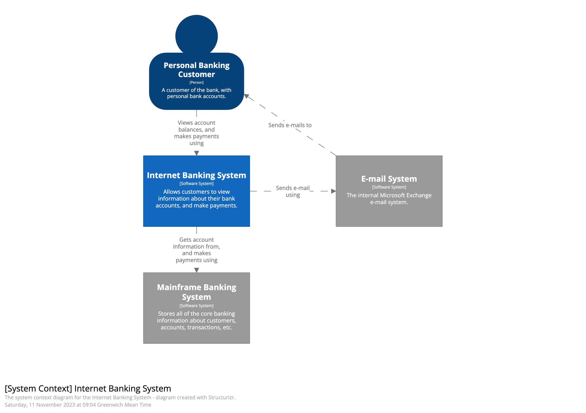

# C4 model

Source: [C4 model website](https://c4model.com/)

Reference: [CSDN - How do software developers understand business requirement?](https://blog.csdn.net/endlessWL/article/details/139784811) (in Chinese)

Context, Containers, Components, Code

## Level 1: Context

```
The system + users + dependencies 
```

Who interact with the system? (role, users)

A set of hierarchical abstractions (software systems, containers, components, and code)



## Level 2: Containers

```
The overall shape of the architecture and technology choices
```
What applications` the system has

What tech stacks they use

How they relate and run at runtime
* How users or other systems interact with it
* How one APP gets data from another APP


## Level 3: Components

```
Logical components and their interactions within a container
```

How codebase is structured

MVC software architecture [Check the _MVC-framework_](MVC-framework.md)

Component Diagram for Internet banking system - API application

* Sign in Controller (logic code) -- security component -- reads from and writes to Database (Container, Model)
* Reset Password Controller (logic code) -- E-mail component -- Sends email using -- Email system
* Accounts Summary Controller (logic code) -- uses Mainframe banking system façade -- Uses Mainframe Banking System (model that stores all core banking information about customers, accounts, transactions, etc.)

## Level 4: Code


